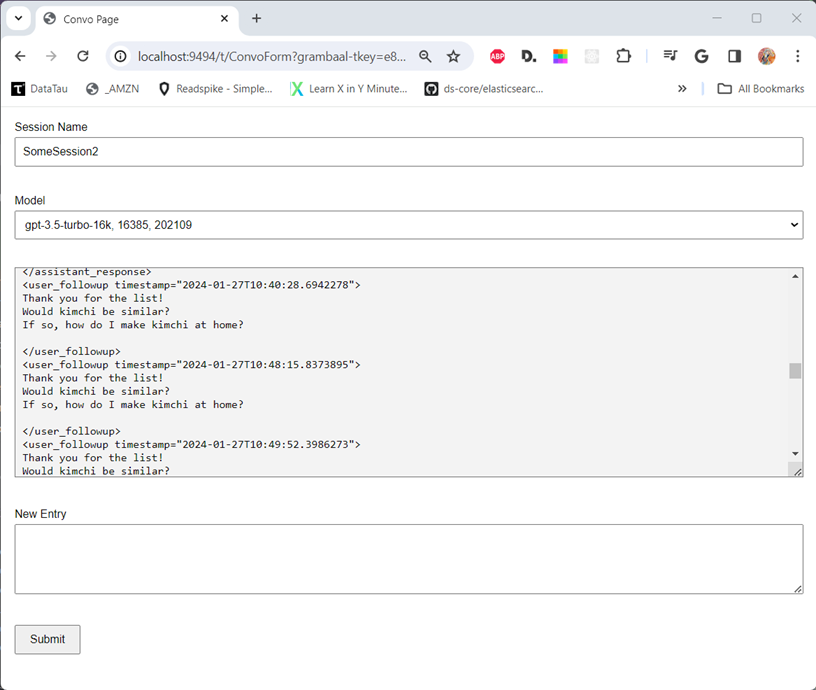

## Grambaal UI

### NEW PROJECT -- IN PROGRESS

- This will be the web UI app for [Grambaal](https://github.com/mring33621/the-grambaal), my file-based LLM chat interaction program.
- It supports multiple Open AI GPT models, as well as Google's Gemini-pro.
- I'm using [Undertow](https://undertow.io/) for its excellent server performance.
- I gave up on hacking at Undertow's ResourceHandler for template rendering.
- Instead, I've added a general use `TemplateProcessingHandler`.
- I'm specifically trying something called [Water Template Engine](https://github.com/tiagobento/watertemplate-engine)
- I plan to use [htmx](https://htmx.org/) for any client-side interactivity, but haven't needed it yet.
- Yes, there's some random login stuff in here ([UsrMgt](https://github.com/mring33621/UsrMgt)). That will eventually move or get replaced with COTS auth.
- Yes, I know I'm silly for not using a batteries-included framework like Spring Boot or Quarkus, but I'm 'learnding' here!
